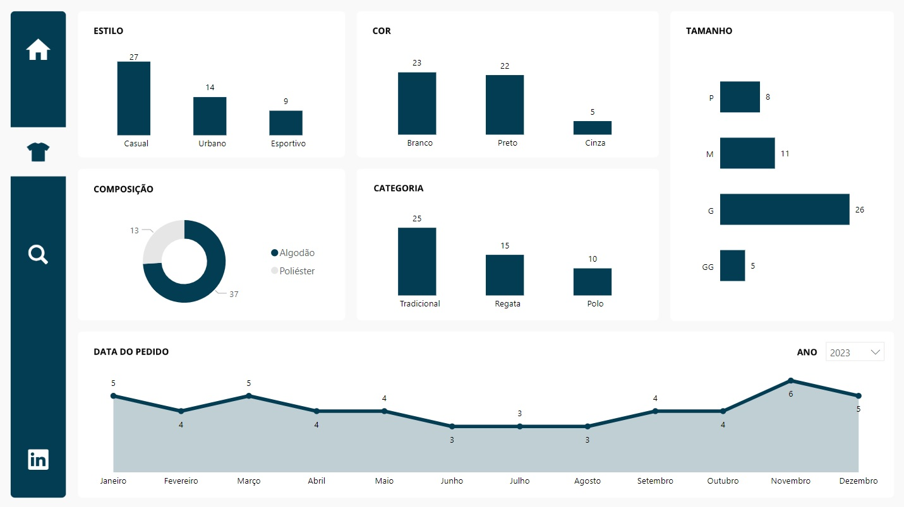
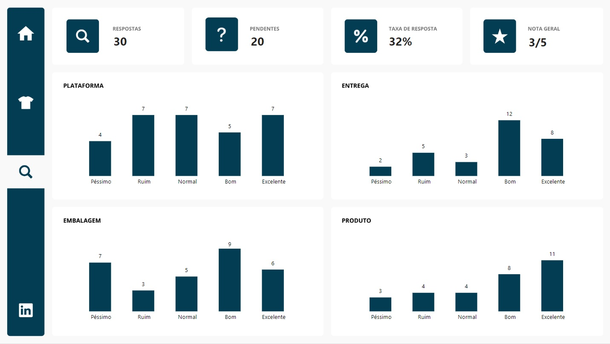

# Relatório de Pedidos

## Objetivo
Este relatório tem como objetivo permitir a análise de pedidos de uma loja de camisetas.

## Páginas

### Capa
Esta página possui um botão para direcionar o usuário para a tela de Produtos.
  

 

### Produtos
Essa página apresenta alguns indicadores chaves, conforme abaixo.

 - Quantidade de Pedidos por Estilo
 - Quantidade de Pedidos por Cor
 - Quantidade de Pedidos por Composição
 - Quantidade de Pedidos por Categoria
 - Quantidade de Pedidos por Tamanho
 - Quantidade de Pedidos por Data do Pedido
  

 

### Pesquisa de Satisfação

Esta página apresenta informações sobre a pesquisa de satisfação.

 - Quantidade de Respostas
 - Quantidade de Pendentes
 - Taxa de Resposta
 - Nota Geral
 - Nota da Plataforma
 - Nota da Entrega
 - Nota da Embalagem
 - Nota do Produto
  

 
